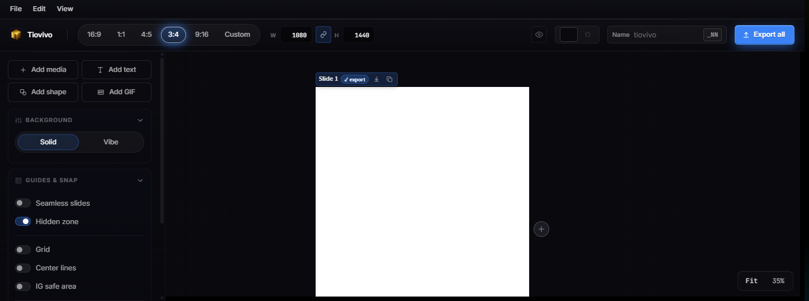
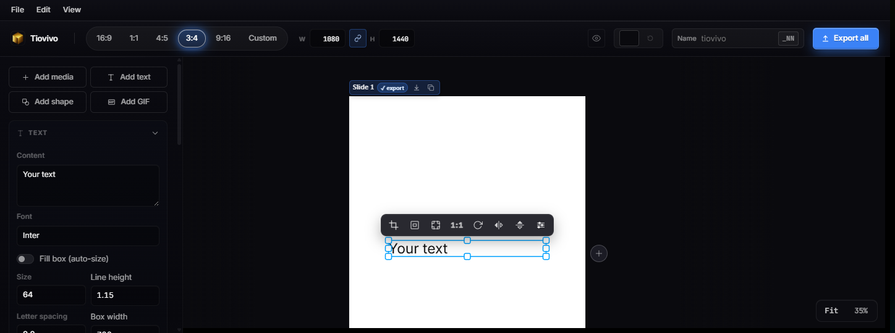
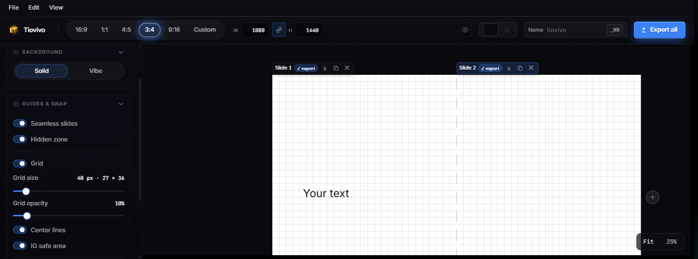
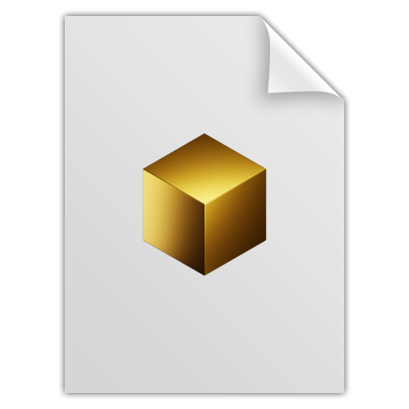

<div align="center">


# Tiovivo

**A multi-slide carousel designer for Instagram-style posts and short video sequences.**

Drop in images and videos, arrange them across slides, tune crops and filters, drop in text — then export the whole carousel as PNGs and hardware-encoded MP4s in one pass.

[](https://github.com/)
[](https://github.com/)
[](https://www.electronjs.org/)
[](https://react.dev/)
[](https://www.typescriptlang.org/)
[](https://vite.dev/)
[](https://konvajs.org/)
[](https://ffmpeg.org/)



The desktop editor for building multi-slide social posts with static images, text, GIFs, and video.

</div>

---

## Product tour

Tiovivo keeps the full carousel in view while still giving each slide its own export controls, background settings, layer stack, and design guides.



**Text and layer editing:** add text, style it, align it, resize it, and manage selected items directly from the side panel and floating canvas toolbar.



**Guides for layout:** toggle seamless mode, grid, center guides, hidden-zone masking, snap controls, and Instagram safe-area overlays while composing.


**Preview mode:** hide editor-only guides, seams, warnings, and safe areas so the canvas matches what final exports should include.

---

## ✨ Features

<table>
<tr>
<td width="50%" valign="top">

### 🖼️ &nbsp;Canvas editor

- Konva-powered editor for unlimited slides per project
- Drag-and-drop images, videos, GIFs straight onto the canvas
- Rich text layers with system-font enumeration, bold / italic, color, line-height and letter-spacing
- Fill-mode text that auto-fits a box as you type
- Per-image **crop, brightness, contrast, saturation, blur, flip**
- Per-video **trim** + **cover-frame** selection

</td>
<td width="50%" valign="top">

### 🎯 &nbsp;Layout & snap

- Format presets — **HD 16:9**, **1:1**, **4:5**, **3:4**, or **Custom** (64 – 8192 px)
- Snap to **grid**, **center**, **other items**, and **safe-area margins**
- Optional grid overlay with adjustable opacity
- Center guides + hidden-zone safe area
- Seamless-slide preview to check edge alignment across the carousel
- Per-slide and global background colors, plus pasteboard color

</td>
</tr>
<tr>
<td width="50%" valign="top">

### 🚀 &nbsp;Hardware-accelerated export

- One-click **Export all** — PNG for static slides, MP4 for video slides
- Per-slide export from the layer stack
- Auto-detects source FPS via `requestVideoFrameCallback`, picks the most common rate, warns on mixed sources
- Encoder probe at runtime:
  - **macOS:** `h264_videotoolbox`
  - **Windows / Linux:** `h264_nvenc` → `h264_qsv` → `h264_amf`
  - Always falls back to `libx264`
- Live downscaled preview frame under the export veil so you can see real progress

</td>
<td width="50%" valign="top">

### 💾 &nbsp;Projects & UX

- `.vpost` project format — a ZIP bundle with manifest + original asset bytes + embedded Fit-view preview
- macOS native menu bar with file associations; in-app menu bar on Windows / Linux
- Recent projects list (per-platform)
- Save-on-quit prompt that actually waits for the save to succeed
- Undo / redo, copy / cut / paste, `[` / `]` to move items between slides
- Drag-reorder slides; duplicate / delete slides
- Code-signed and notarized macOS builds via GitHub Actions

</td>
</tr>
</table>

---

## 📐 Format presets

| Preset       | Dimensions   | Aspect | Common use                        |
| ------------ | ------------ | ------ | --------------------------------- |
| **HD 16:9**  | 1920 × 1080  | 16 : 9 | Landscape video / reels cover     |
| **1 : 1**    | 1080 × 1080  | 1 : 1  | Square IG / LinkedIn post         |
| **4 : 5**    | 1080 × 1350  | 4 : 5  | Portrait IG feed post             |
| **3 : 4**    | 1080 × 1440  | 3 : 4  | Pinterest / tall feed             |
| **Custom**   | 64 – 8192 px | any    | Anything else                     |

---

## 📦 `.vpost` project file

Tiovivo projects are stored as a single `.vpost` file, which is a ZIP bundle containing:

- A JSON **manifest** with slides, items, dimensions, guide settings, and last-used text style
- The **original asset bytes** for every placed image and video — projects are fully portable, no broken links
- An embedded **preview PNG** rendered from the Fit-view of all slides side-by-side, used by the OS file inspector

The file type is associated with the app on install — double-clicking a `.vpost` file opens it in Tiovivo.



---

## 🛠️ Development

```bash
# Install dependencies
npm install

# Run the renderer in the browser (no Electron, no export)
npm run dev

# Run as an Electron app
npm run dev   # then launch electron/main.ts via your runner of choice
```

### Build a desktop installer

```bash
npm run dist
```

Produces, in `release/`:

- macOS: `.dmg` and `.zip` for both `arm64` and `x64`
- Windows: NSIS `.exe` installer for `x64`

CI builds (see [.github/workflows/build.yml](.github/workflows/build.yml)) attach artifacts to every push and draft a GitHub Release for tagged `v*` builds. macOS code-signing and notarization run automatically when the required secrets are configured.

### Keyboard shortcuts

| Action                       | Shortcut              |
| ---------------------------- | --------------------- |
| New project                  | `⌘ / Ctrl + N`        |
| Open project                 | `⌘ / Ctrl + O`        |
| Save / Save as               | `⌘ / Ctrl + S` / `⇧S` |
| Undo / Redo                  | `⌘ / Ctrl + Z` / `Y`  |
| Copy / Cut / Paste           | `⌘ / Ctrl + C / X / V`|
| Delete selected              | `Delete` / `Backspace`|
| Move item to prev / next slide | `[` / `]`           |

---

## 🧱 Tech stack

- **[Electron](https://www.electronjs.org/) 41** — desktop shell, native menus, file associations
- **[React](https://react.dev/) 19** + **[TypeScript](https://www.typescriptlang.org/) 5.9** — renderer UI
- **[Vite](https://vite.dev/) 8** + `vite-plugin-electron` — dev server and bundler
- **[Konva](https://konvajs.org/) 10** + `react-konva` — canvas scene graph and transformer handles
- **[Zustand](https://github.com/pmndrs/zustand) 5** — store with hand-rolled undo / redo snapshots
- **[@dnd-kit](https://dndkit.com/)** — slide-thumbnail drag-reorder
- **[ffmpeg-static](https://github.com/eugeneware/ffmpeg-static)** — bundled FFmpeg binary, used for hardware-accelerated H.264 export with a runtime encoder probe

---

## 📂 Project layout

```
tiovivo/
├── electron/
│   ├── main.ts          # window, menus, FFmpeg encoder probe, IPC
│   └── preload.ts       # contextBridge surface
├── src/
│   ├── App.tsx          # top-level shell, export orchestration, shortcuts
│   ├── components/
│   │   ├── EditorStage.tsx    # Konva stage, transforms, crop, filters, video, text
│   │   ├── LayerStack.tsx     # per-slide layer list
│   │   ├── SlideStrip.tsx     # draggable slide thumbnails
│   │   ├── MenuBar.tsx        # in-app menu bar (Windows / Linux)
│   │   └── NumberField.tsx
│   ├── lib/
│   │   ├── projectFile.ts     # .vpost serialize / deserialize
│   │   ├── zip.ts             # tiny in-house ZIP reader / writer
│   │   ├── thumbnail.ts       # Fit-view preview generator
│   │   ├── snapping.ts        # grid / center / item / margin snap math
│   │   ├── detectVideoFps.ts  # rVFC-based FPS detection
│   │   ├── presets.ts         # format presets
│   │   ├── fonts.ts           # queryLocalFonts + fallbacks
│   │   └── videoRegistry.ts
│   └── store/
│       └── useTiovivoStore.ts # Zustand store with undo / redo
├── resources/                 # app + file icons
├── public/                    # favicon, inline SVG icons
└── .github/workflows/build.yml
```

---

<div align="center">
<sub>Made with <a href="https://www.electronjs.org/">Electron</a> · <a href="https://react.dev/">React</a> · <a href="https://konvajs.org/">Konva</a> · <a href="https://ffmpeg.org/">FFmpeg</a></sub>
</div>
